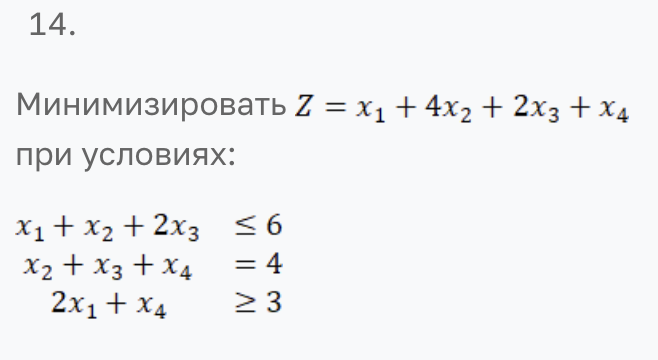

# Лабораторная работа 1

Симплекс-метод линейного программирования на Python: двухфазный решатель с поддержкой неравенств, искусственных переменных и переменных без ограничения знака.

---

## Описание проекта

В первой лабораторной работе я реализовал Python-решатель, который:
- считывает постановку задачи линейного программирования из текстового файла;
- обрабатывает переменные без ограничения знака (unrestricted variables);
- переводит систему ограничений к канонической форме с учётом слэковых и искусственных переменных;
- выполняет фазу поиска допустимого базиса и фазу оптимизации целевой функции;
- возвращает оптимальный план и значение цели либо сообщает о невыполнимости/неограниченности задачи.

## Вариант задания

Необходимо реализовать компьютерную программу на языке высокого уровня (Python или эквивалентный), которая будет решать ЗЛП (полный цикл), выполняя следующие основные шаги:

Считывание текстового файла с файла с постановкой ЗЛП (формат файла - на ваше усмотрение).
Приведение задачу к каноническому виду.
Формирование вспомогательной задачи.
Решение вспомогательную задачу.
Переход к основной задаче (если есть возможность).
Решение основную задачу.
Запись ответа в форме: оптимальная точка , значение целевой функции в оптимальной точке:  или информацию, что решений нет, указав причину.
Необходимо продемонстрировать работу программы на примере согласно варианта общей ЗЛП, сравнивание ответ с тем ответом, который даст MS Excel с помощью надстройки "поиск решения". 

Условие задачи:


## Быстрый старт

### Установка зависимостей

```bash
pip install numpy
```

### Запуск программы

```bash
# Запуск с указанием файла
python simplex.py input_urs.txt
```
## Формат входного файла

Входной файл должен иметь следующую структуру:

```
<количество_переменных> <количество_ограничений>
<тип_задачи>
<коэффициенты_целевой_функции>
[urs <индексы_переменных_без_ограничения_знака>]
<ограничение_1>
<ограничение_2>
...
```

**Пример 1** (задача максимизации):
```
4 3
max
3 2 1 4
2 1 1 0 <= 12
0 1 1 1 = 9
1 0 0 1 >= 4
```

**Пример 2** (с unrestricted переменными):
```
3 2
max
2 -1 3
urs 2
1 2 -1 <= 4
3 -1 2 >= 1
```

Где:
- Строка `urs 2` означает, что переменная x₂ может принимать любые значения (в том числе отрицательные)
- Поддерживаемые знаки: `<=`, `>=`, `=`
- Типы задач: `max` или `min`

## Ход выполнения

### Задание 1. Парсинг входных данных

Функция `parse_input_file(filename)` читает текстовый файл и создаёт объект `LinearProgram` с использованием dataclass-структур. Поддерживается парсинг переменных без ограничения знака (urs).

### Задание 2. Обработка unrestricted переменных

Метод `_handle_unrestricted_variables()` заменяет каждую переменную без ограничения знака x_i на разность двух неотрицательных переменных: x_i = x_i' - x_i''. Это позволяет работать со стандартной формой ЗЛП.

### Задание 3. Приведение к канонической форме

Методы `_build_initial_tableau()` и `_build_phase1_tableau()` строят симплекс-таблицы с добавлением слэковых и искусственных переменных в зависимости от типа ограничений.

### Задание 4. Фаза 1 — поиск допустимого базиса

Метод `_two_phase_method()` запускает фазу 1 для минимизации суммы искусственных переменных. Если сумма не равна нулю, задача несовместна.

### Задание 5. Фаза 2 — оптимизация целевой функции

После успешной фазы 1 метод `_transition_to_phase2()` удаляет искусственные переменные и устанавливает исходную целевую функцию. Затем выполняется стандартный симплекс-метод через `_run_simplex_iterations()`.

### Задание 6. Интерфейс запуска и пример

В корне лежат файлы `input.txt` и `input_urs.txt` с примерами задач. Для запуска:

```bash
python simplex.py input.txt
```

или

```bash
python simplex.py input_urs.txt
```

Программа выводит пошаговое решение с промежуточными таблицами и итоговый результат:
- Оптимальную точку (значения всех переменных)
- Значение целевой функции в оптимальной точке
- Или информацию о том, что решения нет (несовместная система / неограниченная задача)

## Выводы

Реализация подтвердила понимание двухфазного симплекс-метода: от обработки переменных без ограничения знака и нормализации ограничений до итерационной оптимизации. Использование numpy позволило упростить матричные операции и сделать код более компактным.
